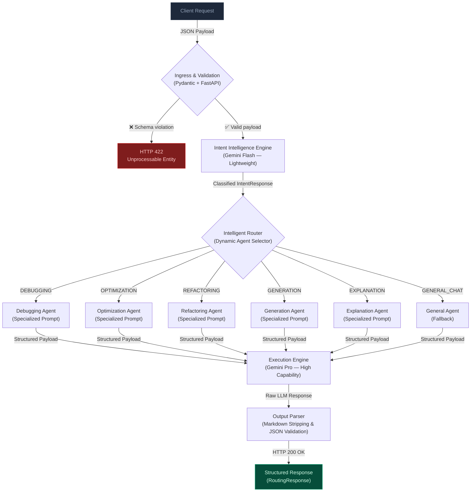

# Syntra AI — System Architecture

> [!NOTE]
> Syntra is not a simple LLM wrapper. It is a **multi-stage orchestration engine** — each layer independently responsible for a discrete transformation of the data payload.

---

## Architectural Philosophy

The Syntra platform follows a **layered pipeline architecture** where each stage performs a single, well-defined responsibility. No layer has knowledge of the layers above it. Every stage communicates exclusively through typed, validated contracts (Pydantic schemas).

---

## The Orchestration Pipeline

---

## Layer Responsibilities

| Layer | Component | Responsibility |
|---|---|---|
| **Ingress** | FastAPI + Pydantic | HTTP routing, request parsing, schema validation, and early rejection of malformed inputs. |
| **Classification** | Intent Intelligence | Lightweight semantic classification of raw intent into a structured `IntentResponse` object. |
| **Routing** | Intelligent Router | Dynamic selection of the target agent based on the classified intent and prompt registry. |
| **Execution** | Specialized Agents | High-capability LLM invocation with a domain-specific, system-engineered system prompt. |
| **Output** | Output Parser | Programmatic sanitization, markdown stripping, and Pydantic validation of the LLM response. |

---

## LLM Abstraction Layer

All LLM interactions are mediated through an internal `BaseLLMProvider` abstract interface. The service layer has **zero direct dependency** on any vendor SDK. This design guarantees:

- **Vendor portability:** Providers can be hot-swapped (Gemini ↔ Claude ↔ OpenAI ↔ Groq) by changing one initialization line in the services.
- **Testability:** Unit tests operate against mock provider implementations.
- **Resilience:** All provider calls are wrapped with graceful error parsing and structured HTTP exception boundaries.

---

## Active Infrastructure & Core Systems

| Component | Layer | Status | Description |
|---|---|---|---|
| **Supabase (PostgreSQL)** | Persistence | ✅ Live | Async logging of all classifications, token usage, workspaces, chat sessions, and history using background tasks. |
| **Context Compressor** | Pre-Execution | ✅ Live | Semantic noise removal to reduce token cost and preserve critical technical blocks before LLM dispatch. |
| **Intelligent Router** | Execution | ✅ Live | central registry pattern executing custom agents for Refactoring, Debugging, Generation, and Explanation. |
| **Pinecone / pgvector** | Vector Storage | 📋 Planned | RAG-based user context injection into the Execution Engine for personalized prompting. |
| **Model Optimizer** | Pre-Execution | 📋 Planned | Target model-specific payload reformatting (e.g., Claude XML structures). |
