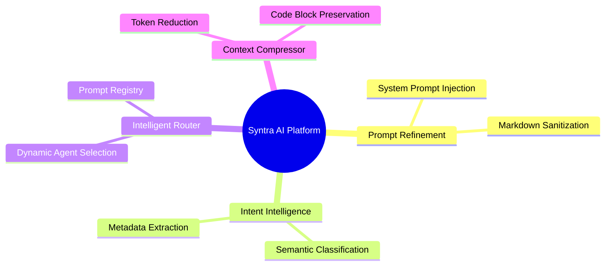

# Syntra AI — Product Overview

## What is Syntra?

Syntra is an **AI Intent Intelligence Platform** — a multi-stage orchestration engine that sits between human intent and machine execution. It intercepts raw, unstructured developer queries, classifies their underlying purpose, and routes them into highly optimized, context-aware AI pipelines.

Syntra does not wrap LLMs. It **engineers** the interface between humans and LLMs.

---

## Core Problem Statement

Modern AI interactions are bottlenecked at the human layer. Developers routinely submit vague, underspecified, and ambiguous prompts to Large Language Models — resulting in hallucinated, generic, or low-quality outputs that waste tokens, time, and compute resources.

**Syntra eliminates this bottleneck** by acting as an Intelligence Translation Layer between the human mind and the model. The platform is completely **free forever** to support the developer community without subscription limits.

---

## Live Core Features

| # | Engine | Status | Description |
|---|---|---|---|
| 1 | **Prompt Refinement** | ✅ Live | Transforms weak, vague developer prompts into premium, system-engineered payloads. |
| 2 | **Intent Intelligence** | ✅ Live | Classifies raw developer intent into structured metadata (Intent, Urgency, Complexity, Domain). |
| 3 | **Context Compressor** | ✅ Live | Condenses heavy inputs and logs by removing semantic noise and conversational filler while strictly preserving code. |
| 4 | **Intelligent Router** | ✅ Live | Dynamically dispatches developer requests and code context to specialized sub-agents based on classification metadata. |

---

## API Surface

All core API endpoints are versioned and ready for integration:

| Endpoint | Method | Engine | Status |
|---|---|---|---|
| `/v1/enhance` | `POST` | Prompt Refinement | ✅ Live |
| `/v1/intent` | `POST` | Intent Intelligence | ✅ Live |
| `/v1/compress` | `POST` | Context Compressor | ✅ Live |
| `/v1/chat` | `POST` | Intelligent Router | ✅ Live |

---

## System Architecture (High-Level)

---

## Target Users

- **Software Engineers** seeking AI-accelerated development and refactoring workflows.
- **AI Product Teams** requiring deterministic, structured LLM outputs at scale.
- **Developer Tools** integrating Syntra as an intent-classification and prompt-enhancement middleware layer.
