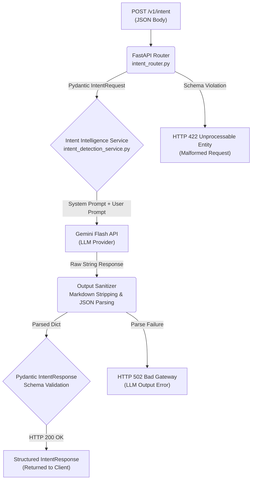

# Intent Intelligence — Technical Specification

| Field | Detail |
|---|---|
| **Document Type** | Technical Specification |
| **Status** | ✅ Implemented & Verified |
| **Version** | 1.0.0 |
| **Model** | Gemini 1.5 Flash (Lightweight Classification) |
| **Endpoint** | `POST /v1/intent` |
| **Last Updated** | 2026-05-29 |

---

## 1. Overview

The **Intent Intelligence Engine** is the semantic classification layer of the Syntra AI platform. It intercepts raw developer prompts, analyzes their underlying purpose, and returns a structured `IntentResponse` object containing the classified intent, urgency level, complexity rating, target domain, and reasoning.

This structured output serves as the routing contract for all downstream execution pipelines. No downstream system processes raw user input directly — all consumption is mediated through the `IntentResponse` schema.

---

## 2. System Flowchart



---

## 3. Intent Taxonomy

All developer queries are classified into exactly one of the following intents:

| Intent | Description | Representative Input |
|:---|:---|:---|
| `DEBUGGING` | Identifying and resolving errors, exceptions, or incorrect logic | *"Why is my React component crashing on mount?"* |
| `REFACTORING` | Restructuring code for clarity or design compliance without altering behavior | *"Make this Python script more readable."* |
| `OPTIMIZATION` | Improving runtime performance, memory efficiency, or reducing API/DB call cost | *"Make this database query run faster."* |
| `GENERATION` | Creating new functional code modules, boilerplates, or templates from specification | *"Write a FastAPI endpoint for user login."* |
| `EXPLANATION` | Clarifying technical concepts, system architecture, or code behavior | *"How does the Strategy Pattern work?"* |
| `GENERAL_CHAT` | Off-topic queries, greetings, or non-engineering requests (graceful fallback) | *"Hello! How are you?"* |

> [!IMPORTANT]
> `GENERAL_CHAT` is the mandatory fallback intent. The classification engine must always return a valid intent. Unknown or ambiguous inputs must resolve to `GENERAL_CHAT` — never to an error state.

---

## 4. Data Contracts (Pydantic Schemas)

Defined in `app/models/schemas.py`.

### Request Schema

```python
from pydantic import BaseModel, Field

class IntentRequest(BaseModel):
    prompt: str = Field(
        ...,
        min_length=2,
        description="The raw developer prompt to be classified."
    )
```

### Response Schema

```python
class IntentResponse(BaseModel):
    original_prompt: str        # Echo of the input for traceability
    primary_intent: str         # Must match the taxonomy exactly (e.g., "DEBUGGING")
    urgency: str                # "low" | "medium" | "high"
    complexity: str             # "simple" | "complex"
    target_domain: str          # e.g., "frontend", "backend", "devops", "general"
    reasoning: str              # One-sentence technical rationale for the classification
```

---

## 5. LLM System Prompt

The following system prompt is injected by `intent_detection_service.py` to enforce structured JSON output from the classification model:

```text
You are Syntra's core Intent Classification Engine.
Your job is to analyze a developer's prompt and extract structured metadata.

You must classify the prompt into EXACTLY ONE of the following intents:
[DEBUGGING, REFACTORING, OPTIMIZATION, GENERATION, EXPLANATION, GENERAL_CHAT]

Rules:
1. You must respond ONLY with valid JSON.
2. Do not include markdown formatting such as ```json or ```.
3. Your output must strictly match this schema:
{
    "primary_intent": "string",
    "urgency": "low | medium | high",
    "complexity": "simple | complex",
    "target_domain": "string (e.g., backend, frontend, devops, general)",
    "reasoning": "string (one concise sentence)"
}
```

---

## 6. Implementation Reference

| Artifact | Path |
|---|---|
| **API Router** | `app/api/routers/intent_router.py` |
| **Service Logic** | `app/services/intent_detection_service.py` |
| **Pydantic Schemas** | `app/models/schemas.py` |
| **LLM Provider** | `app/integrations/llm_clients.py` |

---

## 7. Error Handling Matrix

| Scenario | HTTP Status | Source Layer |
|---|---|---|
| Missing or invalid `prompt` field | `422 Unprocessable Entity` | Pydantic / FastAPI |
| Gemini API timeout or network failure | `502 Bad Gateway` | Service Layer (`try/except`) |
| LLM returns non-parseable output | `502 Bad Gateway` | Output Sanitizer |
| Classified intent not in taxonomy | Falls back to `GENERAL_CHAT` | Service Layer |
