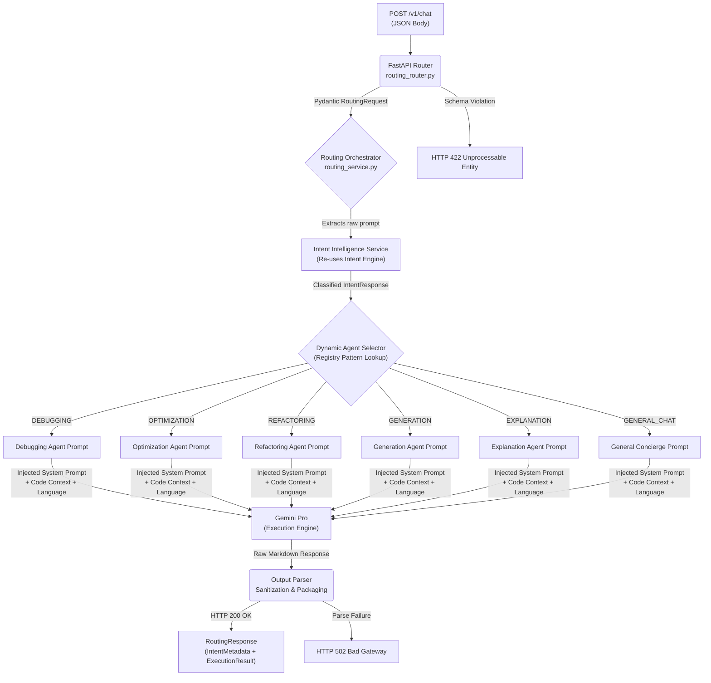

# Intelligent Router — Technical Specification

| Field | Detail |
|---|---|
| **Document Type** | Technical Specification |
| **Status** | ✅ Implemented & Verified |
| **Version** | 1.0.0 |
| **Model** | Gemini 1.5 Flash (Classification) + Gemini Pro (Execution) |
| **Endpoint** | `POST /v1/chat` |
| **Depends On** | Intent Intelligence (`docs/specs/intent-engine.md`) |
| **Last Updated** | 2026-05-29 |

---

## 1. Overview

The **Intelligent Router** is the primary execution pipeline of the Syntra AI platform. It represents the operational layer that acts upon the structured output of the Intent Intelligence Engine.

Once the Intent Intelligence Engine classifies a developer's request into a structured `IntentResponse`, the Intelligent Router:

1. **Selects** the appropriate domain-specific agent from a centralized prompt registry.
2. **Injects** optional developer context (code snippets, target programming language).
3. **Dispatches** the enriched payload to a high-capability execution model (Gemini Pro).
4. **Returns** a combined metadata and execution response.

This system fully operationalizes the intent-to-execution pipeline — transforming Syntra from a classification tool into an end-to-end developer intelligence platform.

---

## 2. System Flowchart



---

## 3. Prompt Registry

Each intent is mapped to a specialized system prompt within `app/prompts/routing_prompts.py`. The registry is implemented as a plain Python dictionary to allow O(1) lookup without conditional branching:

```python
PROMPT_REGISTRY: dict[str, str] = {
    "DEBUGGING":    DEBUGGING_SYSTEM_PROMPT,
    "OPTIMIZATION": OPTIMIZATION_SYSTEM_PROMPT,
    "REFACTORING":  REFACTORING_SYSTEM_PROMPT,
    "GENERATION":   GENERATION_SYSTEM_PROMPT,
    "EXPLANATION":  EXPLANATION_SYSTEM_PROMPT,
    "GENERAL_CHAT": GENERAL_CHAT_SYSTEM_PROMPT,
}
```

### Agent Behavioral Contracts

| Intent | Core Instruction Set | Expected Output Format |
|:---|:---|:---|
| `DEBUGGING` | Identify the exact lines causing the failure, explain the root cause, and provide a single corrected code block. | Bug analysis summary followed by complete, corrected code. |
| `OPTIMIZATION` | Audit for time/space complexity (Big-O notation). Identify redundant allocations, N+1 queries, and network inefficiencies. | Complexity analysis table and refactored high-efficiency code. |
| `REFACTORING` | Apply SOLID principles and DRY patterns. Improve naming, modularity, and readability without altering external behavior. | Structured, clean code with a changelog of modifications. |
| `GENERATION` | Produce complete, production-ready boilerplates or functional modules from a declarative specification. | Annotated, integration-ready code with minimal prose. |
| `EXPLANATION` | Clarify architectural or conceptual logic using step-by-step breakdowns or system analogies where appropriate. | Structured explanation with logical sections and code illustrations. |
| `GENERAL_CHAT` | Maintain a concise, technically fluent, developer-native conversational persona. | Short, direct conversational responses. |

---

## 4. Data Contracts (Pydantic Schemas)

Defined in `app/models/schemas.py`. Extends the Intent Intelligence contract.

### Request Schema

```python
from pydantic import BaseModel, Field

class RoutingRequest(BaseModel):
    prompt: str = Field(
        ...,
        min_length=2,
        description="The raw developer prompt."
    )
    code_context: str | None = Field(
        default=None,
        description="Optional block of source code to be analyzed or referenced."
    )
    language: str | None = Field(
        default=None,
        description="Optional target programming language (e.g., 'python', 'typescript')."
    )
```

### Response Schema

```python
class RoutingResponse(BaseModel):
    intent_metadata: IntentResponse  # Full classification metadata from Intent Intelligence
    execution_result: str            # Final markdown-formatted response from the routed agent
```

---

## 5. Implementation Reference

| Step | Action | Artifact |
|---|---|---|
| **1** | Append `RoutingRequest` and `RoutingResponse` to schemas | `app/models/schemas.py` |
| **2** | Create the prompt registry with specialized system prompts | `app/prompts/routing_prompts.py` |
| **3** | Implement the `RoutingService` — orchestrate intent classification and LLM dispatch | `app/services/routing_service.py` |
| **4** | Expose the `POST /v1/chat` route | `app/api/routers/routing_router.py` |
| **5** | Register the new router in the application factory | `app/main.py` |

---

## 6. Error Handling Matrix

| Scenario | HTTP Status | Source Layer |
|---|---|---|
| Missing or invalid request fields | `422 Unprocessable Entity` | Pydantic / FastAPI |
| Intent classification failure | `502 Bad Gateway` | Intent Intelligence Service |
| LLM execution timeout or API failure | `502 Bad Gateway` | Routing Service (`try/except`) |
| Unrecognized intent (registry miss) | Falls back to `GENERAL_CHAT` agent | Dynamic Agent Selector |
| Unparseable execution output | `502 Bad Gateway` | Output Parser |

---

## 7. Scalability Considerations

> [!NOTE]
> The Registry Pattern used in the Dynamic Agent Selector is intentionally designed for extensibility. Adding a new intent requires only two changes: a new prompt constant in `routing_prompts.py` and a new entry in `PROMPT_REGISTRY`. The router, orchestrator, and all other components require zero modification (Open/Closed Principle).

For future scaling beyond 20+ intents, a two-tier **Hierarchical Routing** strategy should be introduced:

- **Tier 1:** Classify into broad domains (e.g., `CODE_OPERATIONS`, `INFRASTRUCTURE`, `GENERAL`).
- **Tier 2:** Sub-classify within each domain using a specialized, smaller prompt.

This prevents LLM classification accuracy degradation that occurs when a single prompt is asked to distinguish between a large number of closely related intents.
