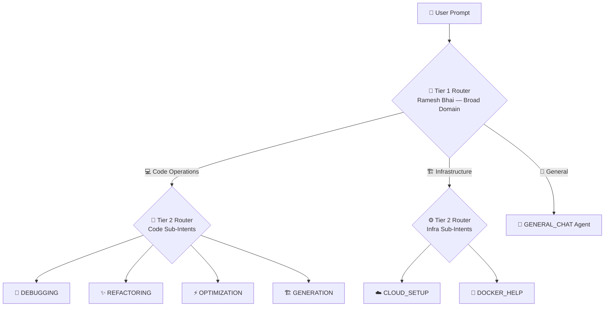

# ♾️ Handling Infinite Intents — Sahyog Restaurant's Expansion Story
> *Written for Uttam — How to scale Syntra AI from 6 intents to 600 without breaking anything* 💪✨

---

## 🤔 Understand the Problem First

As Syntra AI grows, the number of user intents will increase:

```text
Today:      6 intents  → Easy ✅
3rd Month:  20 intents → A bit complex 🤔
6th Month:  50 intents → Danger zone ⚠️
1st Year:  100 intents → It will break if not designed correctly ❌
```

> [!WARNING]
> ❌ **Wrong Approach:** Hardcoding every possible intent into a massive `if-elif` chain. This is like forcing ONE waiter, Suresh at Sahyog Restaurant, to memorize 500 dishes AND cook them all himself. It will collapse!

> [!TIP]
> ✅ **Syntra Approach:** 4 enterprise-grade strategies that allow the system to scale infinitely — without ever needing a full rewrite.

---

## 🛡️ Strategy 1 — The Fallback Mechanism (The "Concierge" — Ramesh Bhai's Backup Plan)

### 🧠 The Concept
**A safety net for edge cases.** Your taxonomy will never be 100% complete. The system must fail gracefully, not crash.

### 🍽️ The Sahyog Restaurant Story

> 👤 A customer walks into Sahyog Restaurant and asks...
> *"Brother, do you sell slippers here?"* 👠 or *"How is the weather outside today?"* 🌧️

| 🚫 Wrong Approach | ✅ Syntra Approach |
|---|---|
| Ramesh Bhai 😰 panics and shuts down the restaurant | Ramesh Bhai 😊 smiles |
| Or forces the customer to eat Biryani (DEBUGGING) | Politely directs the customer to the **General Concierge** (GENERAL_CHAT) |
| System CRASHES 💥 | System SURVIVES gracefully ✨ |

### 🔑 Key Takeaway
```text
Unknown Intent  →  GENERAL_CHAT fallback  →  Smart Baseline LLM
        Never a crash. Always a graceful response. 🎯
```

---

## 📋 Strategy 2 — The Registry Pattern (The "Kitchen Roster" — Vinod's Attendance Register)

### 🧠 The Concept
**Code Scalability.** Separate the router from the execution logic — otherwise, you'll end up with 500-line `if-else` monsters.

### 🍽️ The Sahyog Restaurant Story

> 📈 Sahyog Restaurant wants to expand its menu from **6 dishes to 50 dishes** next year.

| 🚫 Wrong Approach | ✅ Syntra Approach |
|---|---|
| Ramesh Bhai memorizes the recipes for all 50 dishes | Ramesh Bhai has a simple **Kitchen Roster** 📋 |
| Every new dish = retrain Ramesh Bhai 😓 | Every new Chef = just add their name to the roster ✍️ |
| Slow, risky, tightly coupled | Fast, safe, completely modular |

### 💻 How it Looks in Code:
```python
# ✅ The Registry — Sahyog's Kitchen Roster
AGENT_REGISTRY = {
    "DEBUGGING":     DebuggingAgent(),      # 🐛 Chef specializing in bug fixes
    "REFACTORING":   RefactoringAgent(),    # 🔧 Clean code specialist
    "OPTIMIZATION":  OptimizationAgent(),   # ⚡ Speed expert
    "GENERATION":    GenerationAgent(),     # 🏗️ Chef building from scratch
    "EXPLANATION":   ExplanationAgent(),    # 📚 Explaining Chef
    "GENERAL_CHAT":  GeneralChatAgent(),    # 💬 General Concierge (Ramesh Bhai's assistant)
}

# ✅ The Router — Ramesh Bhai who only checks the roster
target_agent = AGENT_REGISTRY.get(detected_intent, AGENT_REGISTRY["GENERAL_CHAT"])
return await target_agent.execute(prompt)
```

> [!IMPORTANT]
> 🏛️ This follows the **"Open/Closed Principle"** ('O' in SOLID):
> - **Open** for extension → Add new Chefs/Agents freely ✅
> - **Closed** for modification → Never touch the core router ✅

---

## 🏗️ Strategy 3 — Hierarchical Classification (The "Captains System" — Section Supervisors)

### 🧠 The Concept
**"Router of Routers."** As intents multiply, a two-tiered system keeps classification fast, accurate, and cheap.

### 🍽️ The Sahyog Restaurant Story

> 🏬 Sahyog Restaurant has now become a **massive food court — with 200 items.**

```text
❌ Wrong Approach:
Ramesh Bhai reads ALL 200 items to EVERY customer
= Slow 🐢, Confusing 😵, Expensive 💸

✅ Syntra Approach:

TIER 1: Ramesh Bhai asks: "Veg 🥦, Non-Veg 🍗, or Drinks ☕?"
              ↓
TIER 2: Non-Veg Section Supervisor asks: "Biryani 🍛, Tandoori 🔥, or Kebab 🥩?"
              ↓
        🎯 Perfect, fast, accurate decision!
```

### 📊 How Syntra Will Scale Like This:



---

## 📦 Strategy 4 — Data-Driven Expansion (The "Suggestion Box" — Customer Feedback Diary)

### 🧠 The Concept
**The Feedback Loop.** Let your USERS tell you what to build next. Don't guess — measure!

### 🍽️ The Sahyog Restaurant Story

> ❓ You need to hire new Chefs — but for which specialty?

| 🚫 Wrong Approach | ✅ Syntra Approach |
|---|---|
| Guess what people want 🎲 | Let USERS vote through their queries 📊 |
| Hire a Chinese Chef — but no one ordered Chinese food | Every fallback query is logged in a **Diary** 📓 |
| Wasted money 💸 | Cluster the data at the end of the month 🧮 |

### 📈 The Growth Loop (Sahyog Restaurant Style):

```text
Month 1: People are asking about "unit testing" → routed to GENERAL_CHAT
Month 2: You analyze the diary → 15% of traffic is for "unit testing"!
Month 3: Officially hire a Testing-Specialist Chef 👨‍🍳
Month 4: TEST_GENERATION is now a first-class intent in Syntra 🎉
```

> [!NOTE]
> 🔑 **This is exactly what happens in real AI products — GitHub Copilot, Cursor.** They don't predict the future — they MEASURE their USERS and build what is actually needed.

---

## 🗺️ The Master Scaling Roadmap

| 📅 Phase | 🎯 Intents | 🛠️ Strategy |
|---|---|---|
| 🟢 Now | 6 Core Intents | Single Router + Fallback |
| 🟡 3rd Month | ~20 Intents | Add Registry Pattern |
| 🟠 6th Month | ~50 Intents | Add Hierarchical Routing |
| 🔴 1st Year | 100+ Intents | Full Data-Driven + Feedback Loop |

> [!TIP]
> 🌟 **Big lesson for interviews:**
> *"We designed Syntra's intent system to be infinitely extensible from day one. Using the Registry Pattern and Hierarchical Routing, we can add 100 new intents without ever modifying the core routing logic. The system literally never needs to be rewritten — only extended."*

---

## 🗂️ Related Documents

| 📄 Document | 🔗 Purpose |
|---|---|
| 📘 `uttam_understand.md` | Master guide for all of Syntra's concepts |
| 🎯 `intent-engine-explained.md` | Deep dive into the Intent Intelligence |
| 🧪 `04_testing_sahyog_restaurant.md` | Testing — Sharma Ji's inspection style |
| ⚙️ `docs/specs/routing-system.md` | Technical spec for Intelligent Router |
