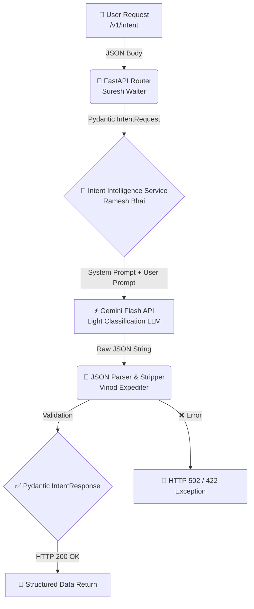

# 🎯 Intent Intelligence — Complete Explanation & Roadmap
> *Written for Uttam — your personal mental model guide to understanding the Syntra Intent Intelligence Engine* 🧠✨

---

## 🍽️ The Big Picture First — Sahyog Restaurant Mental Model

> [!NOTE]
> Before reading any code, understand the analogy. Once you feel the system, the code makes sense automatically.

**Sahyog Restaurant** — FC Road, Pune. One day a customer walks in and says:

> *"Brother, I need something that can be served quickly and is filling!"*

**Suresh (Waiter) ❌ does NOT go straight to the kitchen.**

First, **Ramesh Bhai 🎩 (Manager/Maître D')** — who is our **Intent Intelligence Engine** — analyzes the request:

| 🔍 What They Understand | 📝 Value |
|---|---|
| 🎯 Intent | Ordering Food |
| ⚡ Urgency | High |
| 🥗 Preference | Quick service, filling |

After extracting this **structured data**, Ramesh Bhai knows exactly **which Chef** 👨‍🍳 is best for the job.

> **In Syntra AI:** The **Intent Intelligence Engine** intercepts the raw human thought → categorizes it → extracts metadata → routes it to the correct specialized AI Workflow (Chef). 🚀

---

## 🗺️ The Architecture Flow



---

## 📊 Intent Taxonomy — The 6 Signature Dishes 🍽️

Sahyog Restaurant's **6 signature dishes** — Syntra's 6 core intents:

| 🏷️ Intent | 📖 Description | 💬 Example Customer Request |
|:---|:---|:---|
| 🐛 `DEBUGGING` | Fixing errors, exceptions, or broken logic | *"Why is my React component crashing on mount?"* |
| 🔧 `REFACTORING` | Improving code structure while keeping behavior the same | *"Make this Python script more readable."* |
| ⚡ `OPTIMIZATION` | Enhancing performance, speed, or reducing cost | *"How can this database query run faster?"* |
| 🏗️ `GENERATION` | Creating brand new code or boilerplate | *"Write a FastAPI script for user login."* |
| 📚 `EXPLANATION` | Explaining concepts, system design, or code blocks | *"What is the Strategy Pattern and when is it used?"* |
| 💬 `GENERAL_CHAT` | Hello, off-topic, or non-technical queries | *"How are you? Give me some coding tips!"* |

---

## 🧠 The LLM System Instruction Set

We instruct ⚡ **Gemini Flash** to operate as a strict JSON classifier:

```text
You are Syntra's core Intent Classification Engine.
Your job is to analyze a developer's prompt and extract structured metadata.

You must classify the prompt into EXACTLY ONE of the following intents:
[DEBUGGING, REFACTORING, OPTIMIZATION, GENERATION, EXPLANATION, GENERAL_CHAT]

Rules:
1. You must respond ONLY with valid JSON.
2. Do not include markdown formatting like ```json.
3. Your output must strictly match this schema:
{
    "primary_intent": "string",
    "urgency": "low|medium|high",
    "complexity": "simple|complex",
    "target_domain": "string (e.g., backend, frontend, general)",
    "reasoning": "string (1 short sentence explaining why)"
}
```

> [!IMPORTANT]
> 🔑 **Why Gemini Flash, and not Gemini Pro?**
> Flash is faster ⚡ and cheaper 💰 for simple classification tasks. Pro is saved for the actual code work (actual cooking). The right model for the right task = smart architecture!
>
> **Restaurant analogy:** Cooking Biryani is done by Raju Bhai (Pro). But deciding whether "The customer asked for Biryani or Tea?" — that's done by Ramesh Bhai (Flash). Both tasks are necessary, but the required expertise is different.

---

## 💼 Career Impact — What to Say in Interviews 🎤

> [!TIP]
> 🟦 **Backend / System Design Role:**
> *"I built an intent-driven AI platform. Instead of sending raw prompts to expensive LLMs, we used a lightweight classification engine (Gemini Flash) to extract intent, complexity, and urgency — allowing us to route requests dynamically to specialized models. This optimized performance and saved up to 70% in token costs."*

> [!TIP]
> 🟥 **AI Developer Role:**
> *"I handled the inherent non-determinism of LLMs by building a strict semantic mapping layer. We enforced strict Pydantic parsing with robust sanitation routines to ensure intent intelligence outputs are 100% structured and safe for downstream code execution."*

---

## 🗂️ Related Documents

| 📄 Document | 🔗 Purpose |
|---|---|
| 📘 `uttam_understand.md` | Master guide for all of Syntra's concepts |
| ♾️ `handling-infinite-intents-explained.md` | How to scale beyond 6 intents |
| 🧪 `04_testing_sahyog_restaurant.md` | Testing — Sharma Ji's inspection style |
| ⚙️ `docs/specs/intent-engine.md` | Industry-standard technical specification |
