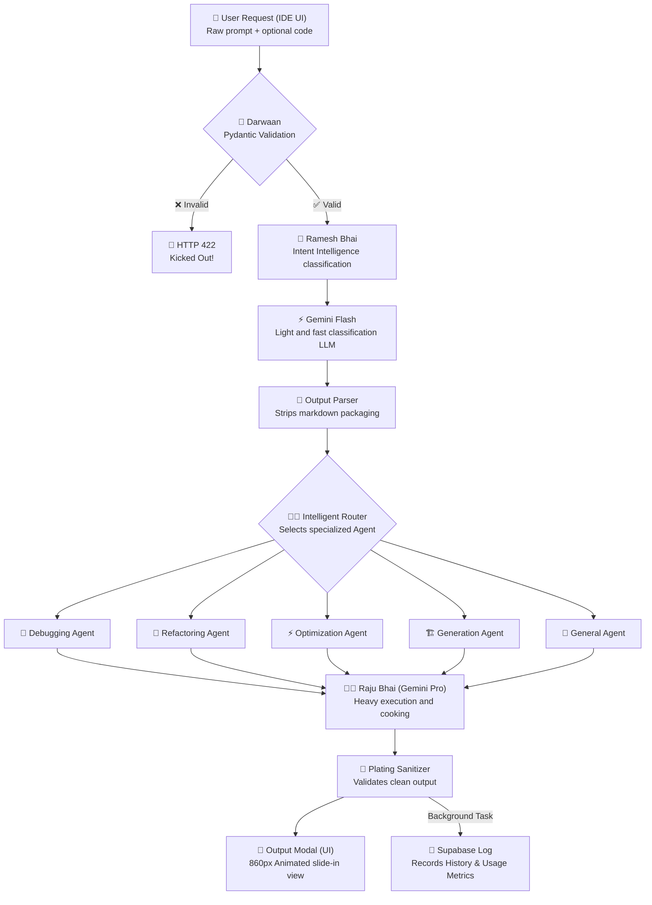

# 🧠 Uttam's Master Learning Guide — Syntra AI
> *Your personal mental model guide for understanding the entire Syntra system* ✨🚀
> *Read this first, then look at the code. Understand the story, and the code will make sense automatically.* 📖

---

## 🍽️ The Grand Mental Model — Sahyog Restaurant, Pune

> [!NOTE]
> 🌟 Every concept in Syntra maps to Sahyog Restaurant on FC Road, Pune. Memorize this table, and you will understand the entire database and backend architecture instantly!

**Sahyog Restaurant** — A famous restaurant on FC Road, Pune. From morning till night, the aroma of Biryani, Dal Makhani, Butter Naan, and Masala Chai fills the air. ☕🍛

| 🍴 Restaurant Role | 🤖 Syntra Equivalent | 📝 What It Does |
|---|---|---|
| 👤 Customer | User | Sends their raw request / raw programming thought. |
| 🚪 Darwaan (Security) | Pydantic Validation | Checks the customer at the door; blocks bad/incomplete orders before they enter. |
| 🎩 Ramesh Bhai (Manager) | Intent Intelligence | Analyzes and classifies what the customer wants. |
| 🙋 Suresh (Waiter) | FastAPI Router | Takes the order and passes it to the correct department. |
| 📋 Vinod (Expediter) | Service Layer | Coordinates the work, cleans up inputs, and packages outputs. |
| 🥤 Vinod's Juice Bar | Context Compressor | Squeezes out the semantic water/noise from logs to save ingredients (tokens). |
| 👨‍✈️ Head Waiter | Intelligent Router | Dynamically selects the best Chef for the job based on Ramesh Bhai's classification. |
| 📖 Recipe Book | System Prompt | Strict instructions for the Chef. |
| 👨‍Chef Raju Bhai | Gemini LLM (Pro) | Does the actual AI heavy cooking. |
| 🍽️ Plating Counter | Output Parser | Cleans, formats, and validates the final response (strips markdown boxes). |
| 📓 Ramesh Bhai's Diary | Supabase Database | Records workspaces, chat history, and token usage metrics. |

---

## 📓 The 6 Database Tables — Ramesh Bhai's Restaurant Log Book

To keep track of everything without introducing unnecessary bloat, Ramesh Bhai maintains a strictly structured **6-table log book** in our PostgreSQL/Supabase database. 

*   **UserSettings Table Eliminated:** We removed the settings table because the restaurant features a permanent, premium warm dark-mode ambiance. No complex light-mode toggles needed!
*   **UserSubscription Table Eliminated:** The restaurant is a **completely free community kitchen** forever! No billing, subscriptions, or credit card blocks.

Here is how the 6 tables map to the restaurant story:

### 1. `users` — The Guest Register
*   **Database Table:** `users`
*   **Restaurant Analogy:** The guest register at the entrance where names and hashed passwords (for guest privacy) are kept.

### 2. `api_logs` — The Kitchen Speed Record
*   **Database Table:** `api_logs`
*   **Restaurant Analogy:** A stopwatch log kept by Vinod showing how fast the kitchen prepared each order (latency in `processing_time_ms`) and which door the order went to. Fired in the background so guests don't wait for paperwork.

### 3. `workspaces` — The Named Tables
*   **Database Table:** `workspaces`
*   **Restaurant Analogy:** Named tables in the restaurant (e.g., "Python Projects Table", "Testing Group Table") where guests sit to collaborate. In the database, this lets us group session histories. *(Frontend UI for this is a planned future expansion, but backend and DB support are active!)*

### 4. `chat_sessions` — The Dining Session
*   **Database Table:** `chat_sessions`
*   **Restaurant Analogy:** The active dining session at a table (e.g., "Lunch Session on May 29"). If a guest sits at a table, they start a session. A default session (id=1) is auto-created on backend startup to ensure history runs smoothly immediately!

### 5. `feature_history` — The Order Book
*   **Database Table:** `feature_history`
*   **Restaurant Analogy:** The waiter's notepad showing exactly what raw food was requested (input prompt), which of the 4 features served it (`enhance`, `intent`, `compress`, `chat`), and the final plated dish (output JSON text). This is loaded instantly into the right-hand **History Drawer** in the UI!

### 6. `usage_metrics` — The Ingredients Registry
*   **Database Table:** `usage_metrics`
*   **Restaurant Analogy:** An ingredients ledger tracking exactly how many grams of raw materials (prompt tokens) and finished ingredients (completion tokens) the Chefs consumed per order. Keeps token costs transparent!

---

## 🚀 The 4 Core Live Engines in Action

### 1. Prompt Refinement (`/v1/enhance`) — *The Recipe Enhancer*
> A guest brings a raw, messy recipe idea. Vinod rewrites it into a premium, system-engineered master prompt with clear rules before passing it to Raju Bhai.

### 2. Intent Intelligence (`/v1/intent`) — *The Order Parser*
> Intercepts raw prompts and automatically classifies them into 6 core intents (`DEBUGGING`, `REFACTORING`, `OPTIMIZATION`, `GENERATION`, `EXPLANATION`, `GENERAL_CHAT`) along with Urgency, Complexity, and Target Domain.

### 3. Context Compressor (`/v1/compress`) — *The Semantic Noise Filter*
> A developer feeds massive, 5000-line server logs. The compressor aggressively strips away conversational repetitive noise and conversational filler, while strictly keeping code blocks, file paths, and error tracebacks intact.

### 4. Intelligent Router (`/v1/chat`) — *The Master Dispatcher*
> The ultimate entry point. Ramesh Bhai classifies the prompt, select the custom system prompt registry, injects the code snippet and programming language, and routes the order to the perfect specialized Chef (e.g., Debug Chef or Optimization Chef) for execution.

---

## 🧩 Key Architecture Principles

### 🚪 Pydantic Validation — The Darwaan (Security Guard)
FastAPI automatically uses these schemas to check **every incoming JSON request**.
*   **Restaurant Story:** A customer arrives at the door. The **Darwaan** 💪 checks: *"Do you have a valid order card? Is your prompt at least 2 characters?"* If not, they are sent away with an **HTTP 422** before Suresh (the Waiter) or Raju Bhai (the Chef) even waste time.
*   **Interview Tip (Backend):** *"I use Pydantic for strong type coercion and schema validation to ensure the core logic is never polluted with malformed data."*

### 🧯 Graceful Error Handling — The Fire Alarm
Contains the blast radius of external API crashes.
*   **Restaurant Story:** Raju Bhai is cooking Biryani and suddenly runs out of chicken (API Rate Limit Exceeded!). Without a try-except block, Raju Bhai panics and flips the tables (server crash). With the fire-alarm block, Vinod steps out calmly and tells the customer: *"We apologize, but we cannot prepare this right now. Please try again soon."* (**HTTP 502 Bad Gateway**).
*   **Interview Tip (AI Developer):** *"I engineer resilient systems by containing the blast radius of external API failures, returning graceful HTTP status codes instead of unhandled tracebacks."*

### 🎨 The Strategy Pattern — The Replaceable Chef
Decoupling core business logic from third-party vendor SDKs.
*   **Restaurant Story:** You hired Raju Bhai (Gemini) as your head chef. But Vinod (Service Layer) only learned to talk to Raju Bhai. If Raju Bhai leaves tomorrow, the restaurant shuts down. Instead, we establish a **Recipe Rulebook (Abstract Base Class)**: *"Whoever is in the kitchen must understand the 'Generate Meal' command."* Now, Raju Bhai, Prakash Bhai (Claude), or OpenRouter can be swapped in with zero impact on Vinod!
*   **Interview Tip (Architect):** *"I implement the Strategy Pattern via Abstract Base Classes to completely abstract third-party LLM providers, avoiding vendor lock-in and supporting hot-swappable models based on cost or performance benchmarks."*

---

## 🗺️ System Data Flow Map

