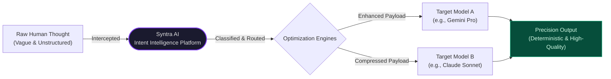

# Syntra AI — Engineering Vision

> *"Syntra bridges the gap between human abstraction and machine precision."*

---

## The Core Problem

Human-to-LLM communication is fundamentally broken.

Developers submit vague, unstructured, and context-starved inputs to large language models. The models, unable to infer missing intent, return hallucinated, generic, or irrelevant outputs. This creates a compounding cycle of re-prompting, wasted tokens, and eroded developer trust in AI tooling.

The root cause is not the LLM. **The root cause is the absence of a structured intent layer between the human and the model.**

---

## The Syntra Solution

Syntra AI acts as an **Intelligence Translation Layer** — a programmatic middleware that intercepts raw human thought and transforms it into a high-density, model-optimized payload before it ever reaches an LLM.

---

## The Ultimate Vision

Syntra will evolve into a fully autonomous, **multi-agent AI orchestration platform** for software engineers.

A developer will simply state:

> *"I need to build a SaaS authentication flow."*

Syntra will autonomously execute the full pipeline:

| Step | Engine | Action |
|---|---|---|
| **1. Detect** | Intent Engine | Classify the core intent as `GENERATION` → domain `backend/auth` |
| **2. Expand** | Context Engine | Infer missing parameters (framework, database, language) |
| **3. Compress** | Compressor Engine | Remove semantic redundancy to minimize token cost |
| **4. Target** | Model Optimizer | Reformat the payload for the target model's behavioral profile |
| **5. Execute** | Routing System | Dispatch to the appropriate specialized agent pipeline |
| **6. Output** | Workflow Generator | Return a deterministic, step-by-step implementation workflow |

---

## North Star Metrics

| Metric | Target |
|---|---|
| **Intent Classification Accuracy** | ≥ 95% on developer query corpus |
| **Token Cost Reduction** | ≥ 60% via compression + targeted routing |
| **Response Determinism** | 100% structured JSON outputs (zero free-form failures) |
| **LLM Vendor Independence** | Hot-swap any provider in < 10 lines of code |

---

## Strategic Principles

1. **The LLM is not the product.** The orchestration layer is the product.
2. **Prompts are software artifacts.** They must be versioned, tested, and deterministic.
3. **Vendor agnosticism is non-negotiable.** No core logic may depend on a specific LLM SDK.
4. **Observability from day one.** Every request, classification, and routing decision is logged.
